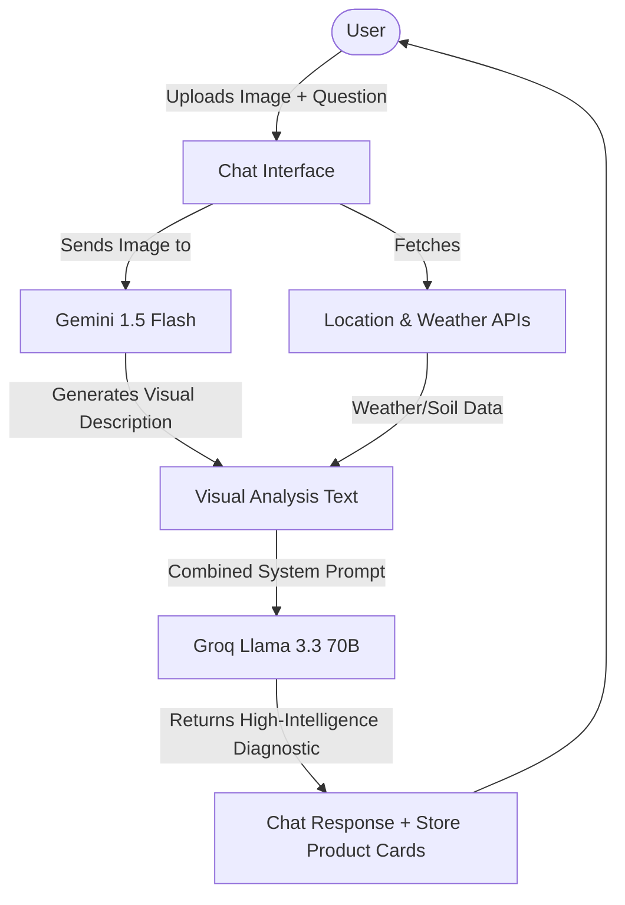

# AgriBot 🌾📸

AgriBot is a state-of-the-art AI-powered smart agriculture assistant and marketplace designed to empower farmers with localized intelligence, rapid plant disease diagnostics, and automated commerce tools. Built with Next.js, AgriBot combines the intelligence of **Groq (Llama 3.3 70B)** and the physical vision capabilities of **Google Gemini 1.5 Flash** for a hybrid AI assistant.

---

## 🌟 Key Features

### 1. Hybrid Multimodal AI Crop Consultant
* **Groq Reasoning**: Uses Llama 3.3 70B for near-instant responses, crop advisory, and treatment recommendations.
* **Gemini Vision**: Seamlessly parses uploaded plant, soil, or pest images. Gemini analyzes the visual context, generates a detailed description, and prepends it to the chat thread for Groq to diagnose.
* **Local Knowledge & Weather Integration**: Automatically fetches real-time coordinates, weather conditions (temp, humidity, wind), and soil profiles to tailor plant diagnostics dynamically.
* **100+ Indian Crops Database**: Loaded with comprehensive details covering growth cycles, optimal soils, diseases, and yields for 100+ sub-continental crops.

### 2. Store & Direct Recommendation System
* E-commerce interface stocked with verified fertilizers, organic remedies, pesticides, and tools.
* The AI is fully inventory-aware and recommends exact store items (e.g. *Syngenta Amistar*, *Bayer Solomon*) that appear in an interactive recommendation carousel beneath the chat response.

### 3. Deno Token (DENO) Web3 Checkout
* Fully integrated blockchain utility token payment system (`1 DENO = ₹10`).
* Dynamic subtotal, shipping, and checkout conversions.
* Generates on-chain compatible recipient wallet address payment QR codes.
* **Animated QR Scanner Simulator**: Renders a moving laser scanner grid, guides camera brackets, and walks the user through a multi-step block verification process (*connecting, verifying gas, signing, on-chain transfer*) before producing a unique TX hash on success.

### 4. Interactive Google Maps Delivery Route Selector
* Built-in dynamic Google Map marker selector.
* Geolocates the user's coordinates instantly using their device's GPS and auto-resolves addresses to pinpoint delivery routes accurately.

### 5. Order Management & Time-Locked Cancellations
* Clear order listings showing payment modes (INR, Online, Deno Token).
* Real-time shipping status tracker (Ordered ➡️ Packed ➡️ Shipped ➡️ Delivered).
* Time-locked **10-minute order cancellation window**.
* Smart conditional notifications (suppresses refund alerts dynamically for Cash on Delivery cancelled orders).

---

## 🛠️ Technology Stack

* **Frontend Framework**: Next.js 15 (App Router), React, TypeScript
* **Styling**: Tailwind CSS & Lucide Icons for clean, responsive Glassmorphic layouts
* **AI Models**: Groq Cloud SDK (Llama 3.3 70B) & Google Gen AI (Gemini 1.5 Flash)
* **Maps API**: React Google Maps (`@react-google-maps/api`)
* **State Management**: React Context (Cart API) & persistent LocalStorage browser caching

---

## 🚀 Getting Started

### 1. Prerequisites
Make sure you have Node.js (version 18+ recommended) and npm installed.

### 2. Clone and Install Dependencies
```bash
git clone https://github.com/yourusername/agricbot.git
cd agricbot
npm install
```

### 3. Environment Configuration
Create a `.env.local` file in the root directory and populate your keys:
```env
# AI API Keys
GROQ_API_KEY=your_groq_api_key_here
GEMINI_API_KEY=your_gemini_api_key_here

# Maps API Keys
NEXT_PUBLIC_GOOGLE_MAPS_API_KEY=your_google_maps_key_here
```

### 4. Run Development Server
```bash
npm run dev
```
Open [http://localhost:3000](http://localhost:3000) in your browser to see the application.

---

## 📐 Architecture: Hybrid Vision Pipeline


